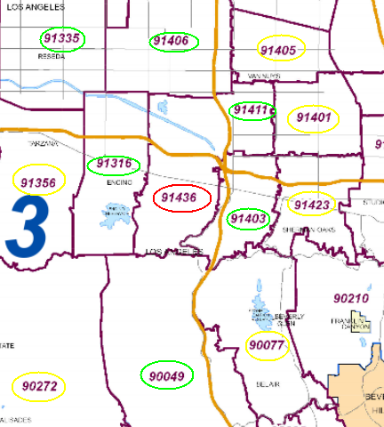

#Scaloop
Rideshare coordination for SCaLE

A way for people to coordinate carpools to SCaLE.
  
This will be done by:  
1) Grouping people together by the proximity to each other from their zip codes (using registration info).  
2) Send out an email to them stating how many people are close to them that are going to SCaLE.  
3) In the above email, have a link to a web page where they could sign up with their email address and zip.  
4) Will send out a email with all of the people who are close to each other with a list of socallinuxexpo.org alias emails where they could contact each other to decide if they would like to share a ride. It will be up to them if and how much information they would like to exchange to setup a rideshare.  
  
Also, would like to have a webpage with a Openstreet map with push pins of where everyone is coming from. And a forum where people could make general announcements of either offering rides, or looking for a ride.

## Example

Say someone from Encino registers, zip code 91436 (circled in Red). Which has neighboring zips 91315, 91335, 91406, 91411, 91402, 90049 (circled in Green). And close zips 91405, 91401, 91423, 90077, 90272, 91356 (circled in Yellow)

They will get an email 4(?) weeks (see issues, to_decide)  before scale saying something like:  
"Hey, these people live close to you and are going to SCaLE, would you like us to contact each other and arrange to share a ride? If, yes go to http://www.socallinuxexpo.org/scale/15x/scaloop and register and you will get a list of aliased emails to contact them" 

After they register, they will get an email closer to SCaLE that contains something like this:
"These people are registered in zip codes 91436. Contact them through these emails:  
scaloop-AHDUMD8804GKK@socallinuxexpo.org  
scaloop-JSYJDN9374HTHT@socallinuxexpo.org  
scaloop-NDGJDBUD98872HRT@socallinuxexpo.org  
These people are in neighboring zip codes 91430, contact them through these emails:  
scaloop-BRTY55323HDTU@socallinuxexpo.org"  
(and so on, will try to limit to certain number (issue, to_decide) closes to them)

More technical detail in [design.md](design.md)

